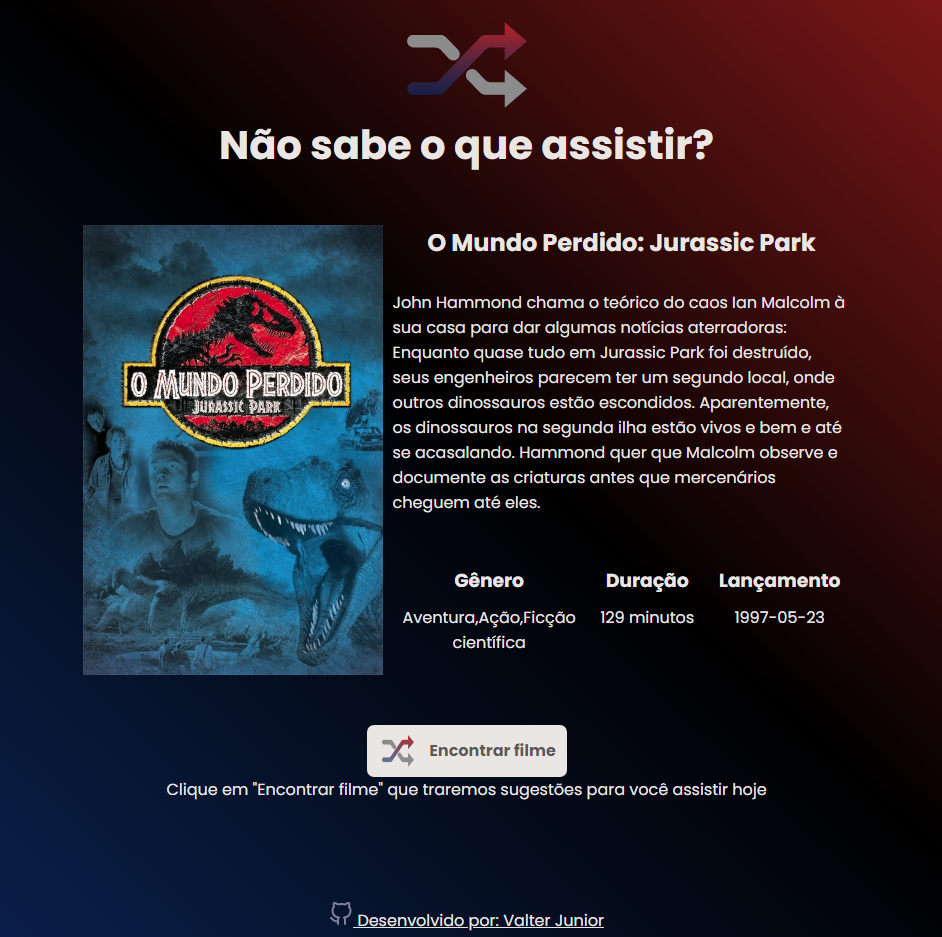
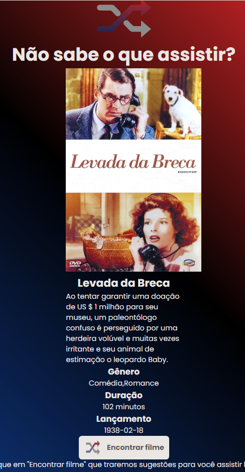

<h1 align="center">SearchFlix</h1>

 🚀 Estudo consumindo API (TMDB) com AXIOS

<h1 align="center"></h1>

•
 <a href="#objetivo">Objetivo</a> •
 <a href="#tecnologias">Tecnologias</a> • 
 <a href="#autor">Autor</a> •

<h1 align="center">
    
    
    
</h1>

## **Objetivo**

 🔍 Treinar CSS e JS e mais sobre APIS com AXIOS 

## **Tecnologias**

<ul>

<li>🛠 HTML
<li>🛠 CSS
<li>🛠 Javascript
<li>🛠 API TMDB
<li>🛠 AXIOS

</ul>

## **Autor**

 Desenvolvido por <a href="https://github.com/valtercfjunior">Valter Junior</a> 
